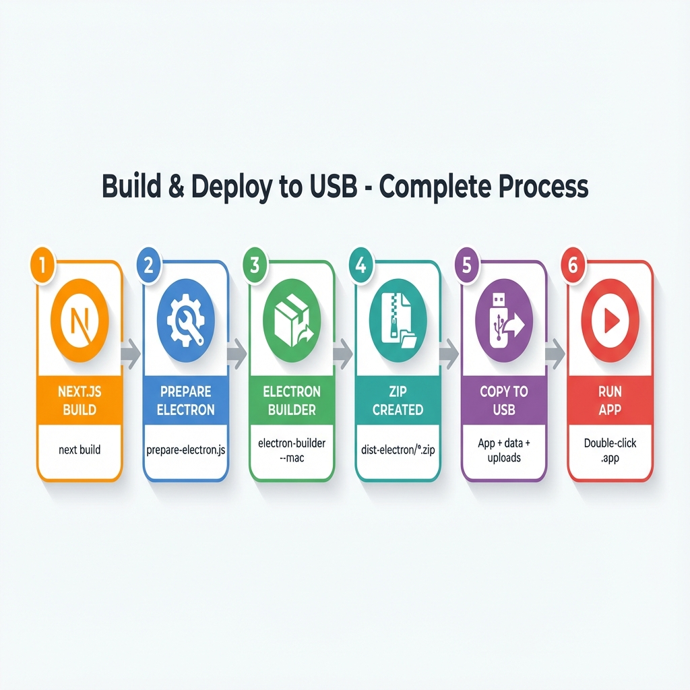

# Babi E-book Portal

## 📦 Build & Deploy to USB - Complete Process



Babi E-book Portal คือระบบจัดการห้องสมุดแบบพกพาที่สร้างด้วย Electron + Vite + React ช่วยให้ผู้ใช้สามารถจัดการและดูคอลเลกชันหนังสือดิจิทัล (PDF และ EPUB) ได้อย่างรวดเร็วและพกพาสะดวก
## ภาพรวมโปรเจกต์

- **วัตถุประสงค์หลัก**: เพื่อเก็บรวบรวมข้อมูลหนังสือและระบบบริหารจัดการทั้งหมดไว้บน Removable Storage (เช่น USB Drive) ทำให้สามารถเคลื่อนย้ายและนำไปใช้งานที่เครื่องอื่นได้อย่างสะดวกโดยไม่ต้องติดตั้งโปรแกรม
- **เฟรมเวิร์ก**: [Electron](https://www.electronjs.org/) + [Vite](https://vitejs.dev/)
- **ภาษา**: TypeScript
- **หน้าบ้าน (Frontend)**: React 19
- **ฐานข้อมูล**: SQLite (ผ่าน [sql.js](https://sql.js.org/))
- **การตกแต่ง**: TailwindCSS 4
- **จุดเด่น**: 
    - **Fast Startup**: ปรับปรุงความเร็วในการเปิดโปรแกรมโดยการเปลี่ยนจาก Next.js มาเป็น Vite
    - **True Portability**: จัดเตรียมข้อมูล (Database/Uploads) ไว้ข้างตัวแอปบน USB ได้โดยตรง
    - **No Port Conflicts**: ไม่ต้องรัน Local Server (Node.js) ในพื้นหลัง ทำให้ไม่มีปัญหาเรื่องพอร์ตถูกใช้งานซ้ำ

## ฟีเจอร์

- **แสดงรายชื่อหนังสือ**: 
- [] เลือกดูหนังสือ
- [x] ระบบแบ่งหน้า
- **ข้อมูลหนังสือ**: 
- [x] รายละเอียดหนังสือ
- [] รายละเอียดผู้แต่ง
- [] รายละเอียดหมวดหมู่
- [] รายละเอียด ISBN
- [] รายละเอียด ภาษาของหนังสือ
- [] รายละเอียด Edition หนังสือ
- **ค้นหา**: 
- [] ค้นหาแบบเรียลไทม์จากชื่อเรื่อง, ผู้แต่ง, หมวดหมู่ หรือ ISBN
- **นำเข้าหนังสือ**: 
- [x] อัปโหลดไฟล์ PDF และ EPUB ได้โดยตรงผ่านแอปพลิเคชัน
- [x] Ask Google เรียกข้อมูลหนังสือจาก Google Books API
- [x] ป้องกันการอัพโหลดไฟล์หนังสือซ้ำได้(ตรวจสอบจาก hash file)
- [] ข้อมูลรายละเอียดหนังสือที่อยู่ใน meta data ไฟล์ PDF จะต้องตรงกับในฐานข้อมูลระบบ 
- **พกพาได้**: ออกแบบมาให้รันได้ด้วย Node.js runtime ในเครื่อง หรือ system runtime
- **เครื่องมืออ่านหนังสือ**
- **รายงาน**:
- **เครื่องมือ**:
- [x]สร้าง hash file หนังสือบางเล่มในฐานข้อมูลไม่มี hash file มาก่อนให้สรา้งปุ่มใต้หน้าปกหนังสือในกรณีไม่พบค่า hash file ของหนังสือเล่นนั้นเมื่อกดจะหาค่า hashfile  และบันทึกลงในฐานข้อมูลทันที และถ้ามีค่า hash file ของ ebook อยู่แล้วให้แสดงค่าแทนปุ่ม(อ้างอิงจากป้องกันการอัพโหลดไฟล์หนังสือซ้ำได้)
- [x] เพิ่มไอคอนช่วยเหลือ(?) อธิบายส่วนต่างๆ ของโปรแกรมว่าทำอะไร
- [x] ปรับจากการเปิดหน้า web browser โดย nodejs ไปยัง Cross Platform Framework เช่น **Electron** แทน (รองรับ Single Executable File)
- [x] เพิ่มแนวทางการ update program ผ่านการใช้ git push code ล่าสุดมา build 
- [x] ปรับปรุงการติดตั้งโปรแกรมครั้งแรกมี ความช้ามากๆ เนื่องจากใช้ nextjs ใช้เวลาในcopy node_module นานมาก
## การเริ่มต้นใช้งาน

### สิ่งที่ต้องมี

- Node.js 18+ (แนะนำ)

### การติดตั้ง

1.  **Clone repository** (ถ้ามี) หรือเข้าไปที่โฟลเดอร์โปรเจกต์:
    ```bash
    cd app
    ```

2.  **ติดตั้ง dependencies**:
    ```bash
    npm install
    ```

### การรันแอปพลิเคชัน

สำหรับเริ่ม development server:

```bash
npm run dev
```

เปิด [http://localhost:3000](http://localhost:3000) ในเบราว์เซอร์เพื่อดูผลลัพธ์

## โครงสร้างโปรเจกต์

/workspaces/iconnext.babi/
├── app-vite/             # แอปพลิเคชัน Electron + Vite (Source Code ปัจจุบัน)
│   ├── src/              # React Frontend
│   ├── electron/         # Electron Main/Preload scripts
│   ├── public/           # Assets
│   └── package.json
├── data/                 # ฐานข้อมูล SQLite (Shared)
├── uploads/              # โฟลเดอร์เก็บไฟล์หนังสือ (Shared)
├── scripts/              # สคริปต์สำหรับช่วย Build และ Sync ลง USB
└── README.md
```

### โครงสร้างไฟล์เมื่อ Deploy ลง USB

เมื่อรัน `deploy.sh` ระบบจะจัดเตรียมไฟล์ลง USB โดยมีโครงสร้างดังนี้ (เหมาะสำหรับการพกพา):

```
[USB_DRIVE_ROOT]/
├── app/                  # Standalone App (ไฟล์ที่ Compiled แล้ว)
│   ├── .next/            # Next.js Build files
│   ├── public/           # Static assets
│   └── server.js         # Entry point สำหรับรัน server
├── bin/                  # Node.js Portable runtimes (ก๊อปปี้มาจาก Dev)
│   ├── mac/
│   └── win/
├── data/                 # ฐานข้อมูล SQLite (Production)
├── uploads/              # ไฟล์หนังสือทั้งหมด (PDF/EPUB)
├── start_mac.sh          # ตัวเปิดโปรแกรม (Mac)
└── start_win.bat         # ตัวเปิดโปรแกรม (Windows)
```

> **ความแตกต่างสำคัญ**: ตัวที่อยู่บน USB จะเป็น "Standalone Build" ซึ่งมีขนาดเล็กกว่าและไม่ต้องใช้ `node_modules` ขนาดใหญ่เหมือนตอน Dev ทำให้ประหยัดเนื้อที่และทำงานได้เร็วกว่าบน Flash Drive

## การแก้ไขฟีเจอร์

นี่คือคำแนะนำสำหรับการแก้ไขส่วนสำคัญของระบบ:

### 1. การแก้ไขระบบนำเข้าหนังสือ (Import Logic)
ส่วนนี้จัดการการอัปโหลดไฟล์ การตรวจสอบ และการบันทึกลงฐานข้อมูล
- **ไฟล์**: `app/src/app/api/books/import/route.ts`
- **ลอจิกสำคัญ**:
    - ตรวจสอบไฟล์ (รองรับ .pdf, .epub).
    - บันทึกไฟล์ (เขียนลงใน `../data/books/...`).
    - บันทึกฐานข้อมูล (อัปเดตตาราง `books`, `authors`, `book_authors`).

### 2. การปรับแต่ง UI
หน้าหลักจะแสดงรายชื่อหนังสือและแถบค้นหา
- **หน้าหลัก**: `app/src/app/page.tsx` (Server Component, จัดการการดึงข้อมูล).
- **ส่วน Client**: `app/src/app/ClientHome.tsx` (Client Component, จัดการการโต้ตอบ).
- **สไตล์**: `app/src/app/globals.css` และคลาส Tailwind

### 3. โครงสร้างฐานข้อมูล (Database Schema)
โปรเจกต์ใช้ SQLite หากต้องการแก้ไขโครงสร้าง:
- ดูไฟล์ `app/check_db.js` หรือ `app/seed_dummy.js` เพื่อดูวิธีการสร้างตาราง
- หากมีการเปลี่ยน Schema อย่าลืมอัปเดต type ใน `app/src/lib/types.ts` (ถ้ามี) และคำสั่ง query ใน `app/src/app/page.tsx`

## การนำขึ้นใช้งาน (Deployment)

เมื่อต้องการ build เพื่อใช้งานจริง:

```bash
npm run build
npm start
```

## การติดตั้งและอัปเดตบน Removable Storage (USB/External Drive)

สำหรับผู้ดูแลระบบที่ต้องการติดตั้ง Babi E-book Portal ลงในอุปกรณ์พกพา:

**วิธีที่แนะนำ (รวดเร็วที่สุด):**

เราได้เตรียมสคริปต์ `deploy.sh` ไว้ให้แล้ว ซึ่งจะทำการ Build โปรเจกต์แบบ Standalone และคัดลอกไฟล์ไปยัง USB ให้โดยอัตโนมัติ

1.  **เสียบ USB** เข้ากับเครื่องคอมพิวเตอร์ (MacOS/Linux)
2.  **รันคำสั่ง**:
    ```bash
    # รูปแบบ: ./deploy.sh [PATH_TO_USB]
    ./deploy.sh /Volumes/MyUSB
    ```
3.  **รอจนเสร็จ**: สคริปต์จะทำการ:
    - Build Next.js แบบ Standalone (ไฟล์เล็กลงมาก)
    - สร้างโครงสร้างโฟลเดอร์บน USB (`app/`, `data/`, `uploads/`, `bin/`)
    - คัดลอกไฟล์ที่จำเป็นทั้งหมด
    - ใช้ `rsync` เพื่ออัปเดตเฉพาะไฟล์ที่เปลี่ยนแปลง (รวดเร็วในการอัปเดตครั้งต่อไป)

> **หมายเหตุสำคัญ (Cross-Platform)**: เนื่องจากโปรเจกต์ใช้ `better-sqlite3` ซึ่งเป็น Native Module หากคุณ Build บนเครื่อง Linux/Mac และนำไปรันบน Windows (หรือกลับกัน) อาจเกิดปัญหาในการโหลด Module ได้ ในกรณีนี้แนะนำให้ใช้วิธีนำ Source Code ไป Build บนเครื่องปลายทาง หรือใช้ `npm rebuild` บนเครื่องปลายทาง

**สำหรับผู้ใช้ Windows:**

เรามีสคริปต์ `deploy.bat` ที่ทำงานเหมือนกันให้ใช้งาน:

1.  เปิด Command Prompt
2.  รันคำสั่ง:
    ```cmd
    :: รูปแบบ: deploy.bat [PATH_TO_USB]
    deploy.bat E:\
    ```
