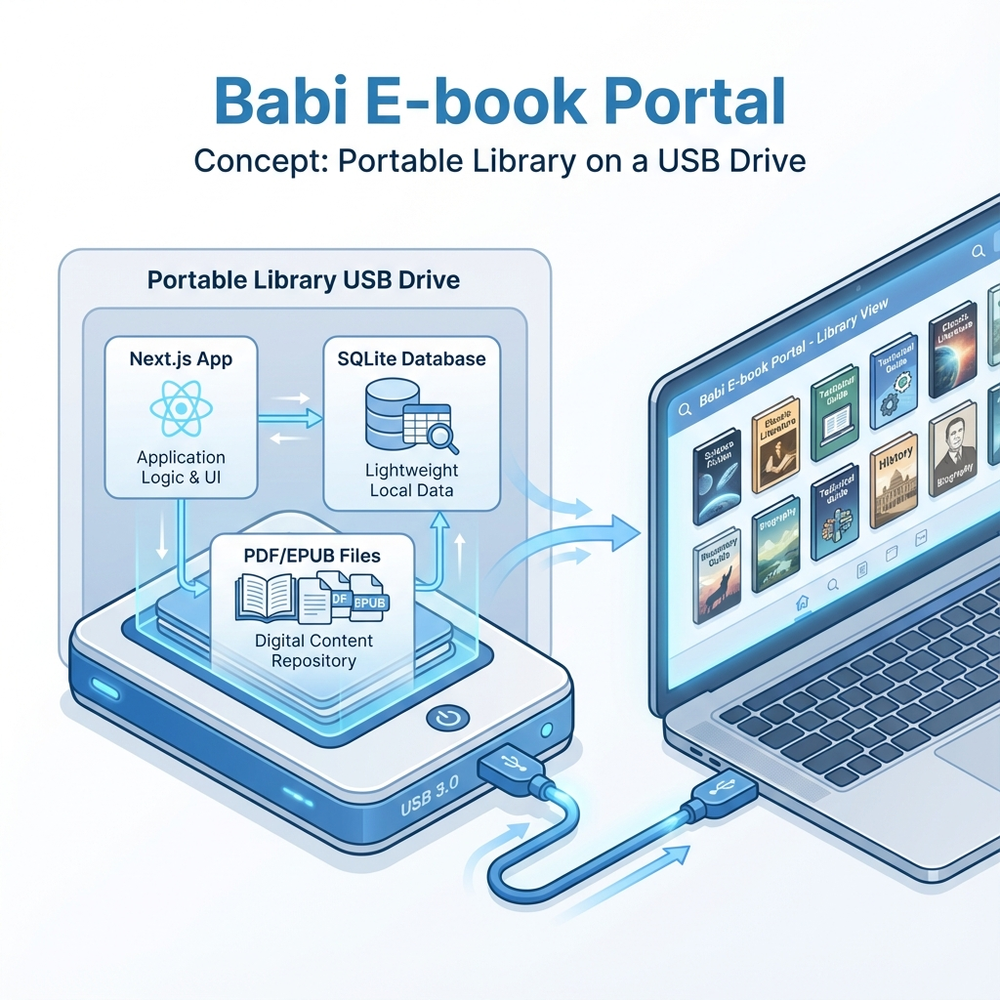

# Babi E-book Portal



Babi E-book Portal คือระบบจัดการห้องสมุดแบบพกพาที่สร้างด้วย Next.js ช่วยให้ผู้ใช้สามารถจัดการและดูคอลเลกชันหนังสือดิจิทัล (PDF และ EPUB) ผ่านอินเทอร์เฟซที่สะอาดและรองรับทุกอุปกรณ์
## ภาพรวมโปรเจกต์

- **วัตถุประสงค์หลัก**: เพื่อเก็บรวบรวมข้อมูลหนังสือและระบบบริหารจัดการทั้งหมดไว้บน Removable Storage (เช่น USB Drive) ทำให้สามารถเคลื่อนย้ายและนำไปใช้งานที่เครื่องอื่นได้อย่างสะดวก
- **เฟรมเวิร์ก**: Next.js 13.4.12 (App Router)
- **ภาษา**: TypeScript
- **ไลบรารี UI**: React 18.2.0
- **ฐานข้อมูล**: SQLite (ผ่าน `better-sqlite3`)
- **การตกแต่ง**: TailwindCSS
- **การจัดเก็บข้อมูล**: ใช้ระบบไฟล์ในเครื่องสำหรับเก็บไฟล์หนังสือ

## ฟีเจอร์

- **รายชื่อหนังสือ**: 
- [] เลือกดูหนังสือ
- [] ระบบแบ่งหน้า
- **ข้อมูลหนังสือ**: 
- [] รายละเอียดหนังสือ
- [] รายละเอียดผู้แต่ง
- [] รายละเอียดหมวดหมู่
- [] รายละเอียด ISBN
- **ค้นหา**: 
- [] ค้นหาแบบเรียลไทม์จากชื่อเรื่อง, ผู้แต่ง, หมวดหมู่ หรือ ISBN
- **นำเข้าหนังสือ**: 
- [] อัปโหลดไฟล์ PDF และ EPUB ได้โดยตรงผ่านแอปพลิเคชัน
- [] Ask Google เรียกข้อมูลหนังสือจาก Google Books API
- **พกพาได้**: ออกแบบมาให้รันได้ด้วย Node.js runtime ในเครื่อง หรือ system runtime

## การเริ่มต้นใช้งาน

### สิ่งที่ต้องมี

- Node.js 18+ (แนะนำ)

### การติดตั้ง

1.  **Clone repository** (ถ้ามี) หรือเข้าไปที่โฟลเดอร์โปรเจกต์:
    ```bash
    cd app
    ```

2.  **ติดตั้ง dependencies**:
    ```bash
    npm install
    ```

### การรันแอปพลิเคชัน

สำหรับเริ่ม development server:

```bash
npm run dev
```

เปิด [http://localhost:3000](http://localhost:3000) ในเบราว์เซอร์เพื่อดูผลลัพธ์

## โครงสร้างโปรเจกต์

```
/workspaces/iconnext.babi/
├── app/                  # แอปพลิเคชัน Next.js หลัก
│   ├── src/
│   │   ├── app/          # หน้าเว็บ App router และ API routes
│   │   ├── components/   # React components
│   │   └── lib/          # Utilities (เช่น การเชื่อมต่อฐานข้อมูล)
│   ├── public/           # ไฟล์ Static assets
│   └── ...config files
├── data/                 # ไฟล์หนังสือที่ถูกจัดเก็บ (อยู่นอก app/ เพื่อให้คงอยู่แม้จะ build ใหม่)
├── start.sh              # สคริปต์สำหรับเริ่มทำงานบน Linux
└── ...
```

## การแก้ไขฟีเจอร์

นี่คือคำแนะนำสำหรับการแก้ไขส่วนสำคัญของระบบ:

### 1. การแก้ไขระบบนำเข้าหนังสือ (Import Logic)
ส่วนนี้จัดการการอัปโหลดไฟล์ การตรวจสอบ และการบันทึกลงฐานข้อมูล
- **ไฟล์**: `app/src/app/api/books/import/route.ts`
- **ลอจิกสำคัญ**:
    - ตรวจสอบไฟล์ (รองรับ .pdf, .epub).
    - บันทึกไฟล์ (เขียนลงใน `../data/books/...`).
    - บันทึกฐานข้อมูล (อัปเดตตาราง `books`, `authors`, `book_authors`).

### 2. การปรับแต่ง UI
หน้าหลักจะแสดงรายชื่อหนังสือและแถบค้นหา
- **หน้าหลัก**: `app/src/app/page.tsx` (Server Component, จัดการการดึงข้อมูล).
- **ส่วน Client**: `app/src/app/ClientHome.tsx` (Client Component, จัดการการโต้ตอบ).
- **สไตล์**: `app/src/app/globals.css` และคลาส Tailwind

### 3. โครงสร้างฐานข้อมูล (Database Schema)
โปรเจกต์ใช้ SQLite หากต้องการแก้ไขโครงสร้าง:
- ดูไฟล์ `app/check_db.js` หรือ `app/seed_dummy.js` เพื่อดูวิธีการสร้างตาราง
- หากมีการเปลี่ยน Schema อย่าลืมอัปเดต type ใน `app/src/lib/types.ts` (ถ้ามี) และคำสั่ง query ใน `app/src/app/page.tsx`

## การนำขึ้นใช้งาน (Deployment)

เมื่อต้องการ build เพื่อใช้งานจริง:

```bash
npm run build
npm start
```
