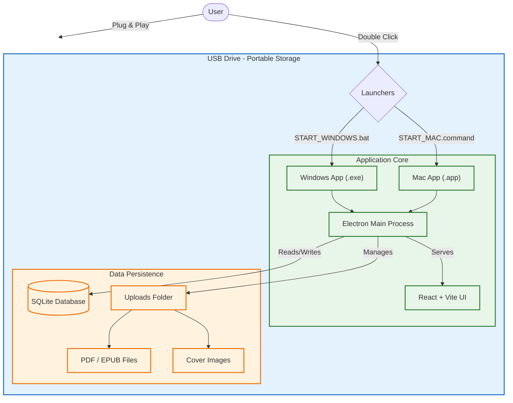

# Babi E-book Portal - Project Overview

```mermaid
graph TD
    %% Nodes
    User([User])
    
    subgraph USB_Device ["USB Drive - Portable Storage"]
        direction TB
        Launchers{"Launchers"}
        
        subgraph App_Core ["Application Core"]
            WinApp["Windows App (.exe)"]
            MacApp["Mac App (.app)"]
            Backend["Electron Main Process"]
            Frontend["React + Vite UI"]
        end
        
        subgraph Data_Layer ["Data Persistence"]
            DB[("SQLite Database")]
            Files["Uploads Folder"]
            Books["PDF / EPUB Files"]
            Covers["Cover Images"]
        end
    end

    %% Connections
    User -->|"Plug & Play"| USB_Device
    User -->|"Double Click"| Launchers
    
    Launchers -->|"START_WINDOWS.bat"| WinApp
    Launchers -->|"START_MAC.command"| MacApp
    
    WinApp --> Backend
    MacApp --> Backend
    
    Backend -->|Serves| Frontend
    Backend -->|"Reads/Writes"| DB
    Backend -->|Manages| Files
    
    Files --> Books
    Files --> Covers

    %% Styling
    classDef storage fill:#e3f2fd,stroke:#1565c0,stroke-width:2px;
    classDef app fill:#e8f5e9,stroke:#2e7d32,stroke-width:2px;
    classDef data fill:#fff3e0,stroke:#ef6c00,stroke-width:2px;
    
    class USB_Device storage;
    class App_Core,WinApp,MacApp,Backend,Frontend app;
    class Data_Layer,DB,Files,Books,Covers data;
```
