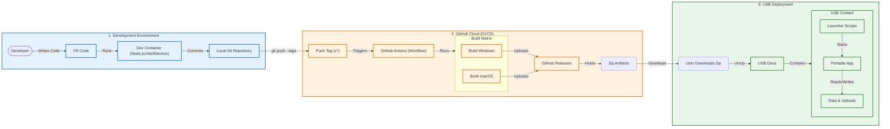

# Development to USB Workflow

```mermaid
graph LR
    %% Styles
    classDef dev fill:#e3f2fd,stroke:#1565c0,stroke-width:2px;
    classDef ci fill:#fff3e0,stroke:#ef6c00,stroke-width:2px;
    classDef usb fill:#e8f5e9,stroke:#2e7d32,stroke-width:2px;

    %% 1. Development Phase
    subgraph Dev_Env ["1. Development Environment"]
        direction TB
        Developer([Developer])
        VSCode["VS Code"]
        DevContainer["Dev Container (Node.js/Vite/Electron)"]
        GitRepo["Local Git Repository"]
    end

    %% 2. CI/CD Phase
    subgraph GitHub_Cloud ["2. GitHub Cloud (CI/CD)"]
        direction TB
        PushTag["Push Tag (v*)"]
        Actions["GitHub Actions (Workflow)"]
        
        subgraph Builders ["Build Matrix"]
            BuildWin["Build Windows"]
            BuildMac["Build macOS"]
        end
        
        ReleasePage["GitHub Releases"]
        Artifacts["Zip Artifacts"]
    end

    %% 3. Deployment Phase
    subgraph User_Deploy ["3. USB Deployment"]
        direction TB
        Download["User Downloads Zip"]
        USBDrive["USB Drive"]
        
        subgraph USB_Content ["USB Content"]
            Launchers["Launcher Scripts"]
            App["Portable App"]
            Data["Data & Uploads"]
        end
    end

    %% Relationships
    Developer -->|"Writes Code"| VSCode
    VSCode -->|"Runs"| DevContainer
    DevContainer -->|"Commits"| GitRepo
    GitRepo -->|"git push --tags"| PushTag
    
    PushTag -->|"Triggers"| Actions
    Actions -->|"Runs"| Builders
    
    BuildWin -->|"Uploads"| ReleasePage
    BuildMac -->|"Uploads"| ReleasePage
    
    ReleasePage -->|"Hosts"| Artifacts
    Artifacts -->|"Download"| Download
    
    Download -->|"Unzip"| USBDrive
    USBDrive -->|"Contains"| USB_Content
    Launchers -->|"Starts"| App
    App -->|"Reads/Writes"| Data

    %% Apply Styles
    class Dev_Env,VSCode,DevContainer,GitRepo dev;
    class GitHub_Cloud,PushTag,Actions,BuildWin,BuildMac,ReleasePage ci;
    class User_Deploy,USBDrive,USB_Content,Launchers,App,Data usb;
```
